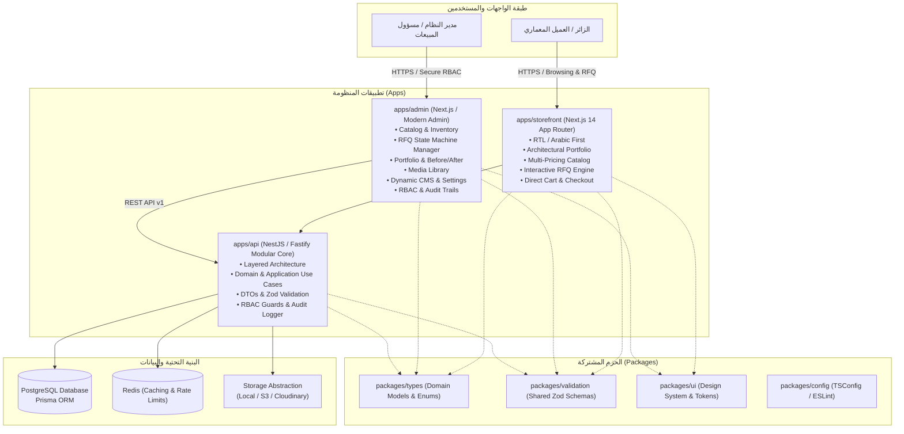

# System Architecture — المعمارية التقنية للمنصة

## 1. Overview
منصة **«الوحيد للزخرفة المعمارية والنحت والمقاولات العامة»** مبنية وفق نمط **Modular Monolith** مع الالتزام بمبادئ **Clean Architecture** و **Domain-Driven Design (DDD) الخفيف**.

المشروع منظم كـ **Monorepo** باستخدام **pnpm workspaces** و **Turborepo** لتحقيق أعلى كفاءة في البناء، والتكامل، ومشاركة الأنواع والتحققات.

---

## 2. High-Level Architecture Diagram

---

## 3. Core Modules & Domain Boundaries

النظام مقسم إلى موديولات مستقلة ذات حدود واضحة (Bounded Contexts):

1. **Catalog Module (`modules/catalog`):**
   - إدارة المنتجات الحجرية، الفئات، المواد (حبش، رخام، حجر بيج...)، التشطيبات (بوشارده، مجلي، مسمسم، مطبه...)، الألوان، والمقاسات.
   - يدعم أنماط التسعير المتعددة (`ProductPricingMode`).

2. **Quotations & RFQ Module (`modules/quotations`):**
   - إدارة طلبات عروض الأسعار والتصاميم المخصصة.
   - محرك الحالات (State Machine) لضبط مسار الطلب: `NEW` ➔ `UNDER_REVIEW` ➔ `PRICED` ➔ `SENT` ➔ `ACCEPTED` ➔ `CONVERTED_TO_ORDER`.
   - إرفاق المخططات الهندسية والصور مع حماية الملفات.

3. **Portfolio & Projects Module (`modules/projects`):**
   - إدارة سابقة الأعمال والمشاريع المنفذة (واجهات، فلل، قصور، مداخل، تيجان، نوافير).
   - دعم صور المقارنة (Before / After)، ربط المواد المستخدمة والخدمات المنفذة.

4. **Orders & Commerce Module (`modules/orders`):**
   - إدارة الطلبات المباشرة، عربة التسوق، الفواتير، وحالات الدفع والتجهيز.
   - طبقة تجريد بوابات الدفع (`PaymentProvider`).

5. **Media Asset Module (`modules/media`):**
   - مكتبة وسائط مركزية مع تجريد التخزين (`FileStorageProvider`).
   - تحسين الصور (WebP/AVIF)، توليد الصور المصغرة، والتحقق الصارم من الـ MIME.

6. **Content & Settings Module (`modules/content`, `modules/settings`):**
   - إدارة محتوى الصفحة الرئيسية (Hero, Banners, Trust Factors, Services, FAQs).
   - إدارة الإعدادات العامة المتغيرة (أرقام التواصل، WhatsApp، ساعات العمل، العملة، الروابط).

7. **Auth & RBAC Module (`modules/auth`, `modules/users`):**
   - مصادقة آمنة عبر JWT مع HttpOnly Cookies.
   - تحكم صارم بالصلاحيات على مستوى الـ Backend: `SUPER_ADMIN`, `ADMIN`, `CATALOG_MANAGER`, `SALES_MANAGER`, `CONTENT_MANAGER`.

8. **Audit & Analytics Module (`modules/audit`, `modules/analytics`):**
   - سجل تدقيق غير قابل للتعديل (`AuditLog`) للعمليات الحساسة.
   - تتبع تحليلي للأحداث المعمارية والتجارية دون انتهاك خصوصية الزائر.
