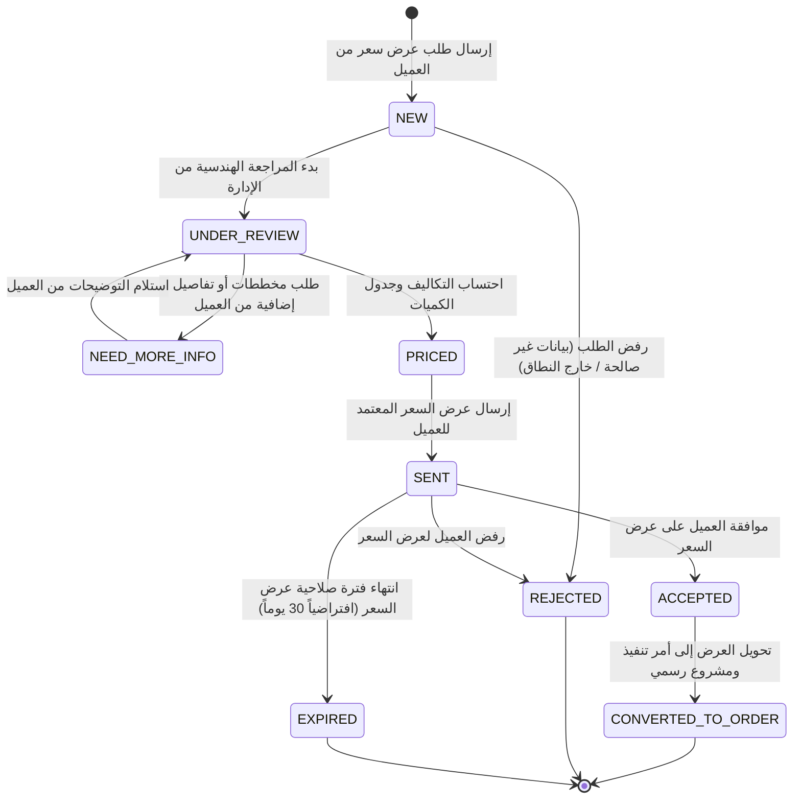

# Business Rules & State Machines — قواعد العمل ودورات الحياة

## 1. Quotation State Machine (محرك حالات عروض الأسعار)

يمنع النظام الانتقالات العشوائية بين حالات طلبات عروض الأسعار لضمان النزاهة والمتابعة الهندسية الدقيقة.

### مصفوفة الانتقالات المسموح بها (Allowed State Transitions)

### قواعد التحقق على عروض الأسعار:
1. لا يمكن نقل الطلب إلى `PRICED` إلا إذا تم تسعير جميع البنود (`QuotationItem`) أو تحديد إجمالي معتمد وشروط الدفع والتوريد.
2. لا يمكن الانتقال من `ACCEPTED` إلى `NEW`.
3. عند نقل الطلب إلى `CONVERTED_TO_ORDER`، يتم تلقائياً إنشاء سجل مشروع أو أمر توريد مرتبط بنفس المعرف لضمان تتبع دورة العمل بالكامل.

---

## 2. Product Purchase & Quotation Rules (قواعد الشراء والتسعير)

1. **المنتجات ذات السعر الثابت (`FIXED_PRICE` / `PER_PIECE` / `PER_SQUARE_METER` مع تحديد السعر):**
   - يمكن إضافتها مباشرة إلى عربة التسوق والمتابعة للشراء المباشر.
   - عند الشراء بالمتر المربع أو الطولي، يتم احتساب الإجمالي بناءً على: `Quantity × PricePerUnit`.

2. **المنتجات التقديرية أو المخصصة (`STARTING_FROM` / `CUSTOM_QUOTE` / `CONTACT_FOR_PRICE`):**
   - يتم تعطيل زر "الشراء المباشر" تلقائياً واستبداله بزر تفاعلي: **«اطلب تسعير لهذا التصميم / استفسر عبر واتساب»**.
   - يتم نقل العميل مباشرة إلى نموذج الـ RFQ مع تعبئة بيانات المنتج ونوعه ومواصفاته آلياً في النموذج.

---

## 3. Order Lifecycle (دورة حياة الطلب المباشر)

- **`PENDING`**: تم إنشاء الطلب بانتظار تأكيد الدفع أو تأكيد التحويل البنكي.
- **`CONFIRMED`**: تم التحقق من الطلب واعتماده من قسم المبيعات.
- **`PROCESSING`**: قيد القص، التجهيز، الصقل، والنحت في الورش والمعامل الحجرية.
- **`READY_FOR_DISPATCH`**: تم فحص الجودة وتجهيز الأحجار للنقل والتحميل.
- **`SHIPPED` / `OUT_FOR_DELIVERY`**: خرجت شحنة الأحجار مع شاحنة النقل إلى موقع العميل.
- **`DELIVERED`**: تم التسليم والتنزيل في الموقع وتوقيع سند الاستلام.
- **`CANCELLED`**: ملغى (مسموح فقط قبل انتقال الطلب إلى مرحلة التجهيز `PROCESSING`).

---

## 4. Search & Arabic Text Normalization (قواعد البحث ومعالجة اللغة العربية)

- تطبق خوارزمية تطبيع عربية ذكية (Normalization) على محرك البحث:
  - توحيد الهمزات: `[أ إ آ]` ➔ `ا`
  - توحيد التاء المربوطة والهاء: `[ة]` ➔ `ه`
  - توحيد الياء والألف المقصورة: `[ى]` ➔ `ي`
  - إزالة التشكيل والتطويل (الكشيدة).
- الحفاظ على النص الأصلي المخزن في قاعدة البيانات وعرضه بدقة دون تشويه، بينما تتم المقارنة في الفهارس على النسخة المطبعة لضمان أفضل نتائج بحث وتجربة مستخدم.
