# Database Schema & Entity Design — تصميم قاعدة البيانات

## 1. Overview
تعتمد المنصة على قاعدة بيانات علائقية **PostgreSQL** تُدار من خلال **Prisma ORM**، مع تصميم منظم للجداول والعلاقات يمنع التكرار (Normalization) ويستخدم أنواع بيانات صريحة بدلاً من إغراق الجداول بحقول JSON غير المهيكلة.

---

## 2. Entity Relationship Diagram (Mermaid)

```mermaid
erDiagram
    User ||--o{ UserRole : has
    Role ||--o{ UserRole : assigned
    Role ||--o{ RolePermission : has
    Permission ||--o{ RolePermission : granted

    Category ||--o{ Product : contains
    Product ||--o{ ProductImage : has
    Product ||--o{ ProductVariant : offers
    Product ||--o{ ProductMaterial : uses
    Product ||--o{ ProductFinish : features
    Material ||--o{ ProductMaterial : linked
    Finish ||--o{ ProductFinish : linked
    Color ||--o{ ProductVariant : colored

    ProjectCategory ||--o{ Project : categorizes
    Project ||--o{ ProjectImage : displays
    Project ||--o{ ProjectMaterial : utilizes
    Material ||--o{ ProjectMaterial : applied_in

    Customer ||--o{ Quotation : requests
    Quotation ||--o{ QuotationItem : includes
    Quotation ||--o{ QuotationAttachment : attaches
    Quotation ||--o{ QuotationStatusHistory : tracks
    Quotation ||--o{ QuotationMessage : dialogues

    Customer ||--o{ Order : places
    Order ||--o{ OrderItem : details
    Order ||--o{ OrderStatusHistory : tracks
    Order ||--o{ PaymentTransaction : records

    User ||--o{ AuditLog : performs
    MediaAsset ||--o{ ProductImage : references
    MediaAsset ||--o{ ProjectImage : references
```

---

## 3. Core Entities & Data Dictionary

### A. Catalog & Materials
- **`Category`**: تصنيفات المنتجات (أحجار بناء، تيجان وأعمدة، زخارف ونقوش، مشربيات وإطارات، رخام، مدافئ، شلالات).
- **`Material`**: أنواع الحجر الطبيعي والرخام (حجر حبش أسود، حجر بيج ناعم، حجر سيلاني، حجر أبيض جبلي، رخام كرارا، جرانيت).
- **`Finish`**: معالجات وتشطيبات الأسطح الحجرية (بوشارده، مجلي ناعم، مسمسم، مطبه، أنتيك، خشن طبيعي).
- **`Color`**: لوحة ألوان الأحجار الطبيعية (بيج رملي، أسود حبشي، رمادي بركاني، أبيض صخري، أحمر قاني).
- **`Product`**: بيانات المنتج المعماري، الـ Slug، نمط التسعير، الوصف، المواصفات الفنية، والأبعاد الافتراضية.
- **`ProductVariant`**: المقاسات المتوفرة (طول × عرض × سماكة)، وزن المتر المربع، والزيادة السعرية.

### B. Pricing Modes (`ProductPricingMode`)
1. `FIXED_PRICE`: سعر قطعي ومحدد للوحدة الواحدة.
2. `STARTING_FROM`: سعر تقديري يبدأ من قيمة معينة حسب المقاس أو النقش.
3. `PER_PIECE`: تسعير بالقطعة المجهزة.
4. `PER_SQUARE_METER`: تسعير بالمتر المربع (m²) للكسوات والأرضيات والواجهات.
5. `PER_LINEAR_METER`: تسعير بالمتر الطولي (m) للكورنيشات والإطارات والأحزمة الحجرية.
6. `PER_CUBIC_METER`: تسعير بالكتل الحجرية والمكعبات للأعمال الإنشائية الضخمة.
7. `CUSTOM_QUOTE`: عمل فني أو نحت آلي بمكائن CNC ومخارط خاصة يتطلب دراسة تفاصيل التصميم.
8. `CONTACT_FOR_PRICE`: للمشاريع الكبرى والتوريدات المفتوحة.

### C. Projects & Portfolio
- **`Project`**: المشروعات المنجزة، نوع العقار (فيلا، قصر، مبنى تجاري، مسجد، مدخل)، الموقع العام، وتاريخ الإنجاز.
- **`ProjectImage`**: صور عالية الدقة مع تصنيف نوع الصورة (`MAIN`, `GALLERY`, `BEFORE`, `AFTER`, `DETAIL`).

### D. Quotation Engine (RFQ)
- **`Quotation`**: السجل الرئيسي لطلب السعر، رمز التتبع (RFQ-XXXXXX)، العميل، المدينة، نوع المشروع، الميزانية التقريبية، ملاحظات الموقع والتسليم، والحالة الحالية.
- **`QuotationItem`**: البنود المطلوبة ومقاساتها ونوع الحجر والكميات.
- **`QuotationAttachment`**: المخططات الهندسية (PDF/CAD) وصور التصاميم المرفوعة مع الحجم والـ MIME type.
- **`QuotationStatusHistory`**: سجل تاريخي غير قابل للتلاعب يرصد من غيّر الحالة، التوقيت، وسبب التغيير.
- **`QuotationMessage`**: محادثات وتفاصيل تسعير بين الإدارة والعميل.

### E. E-Commerce & Orders
- **`Order`**: رقم الطلب المباشر، بيانات المستلم، العنوان، المجموع الفرعي، الخصومات، رسوم النقل والتنزيل، الإجمالي، وحالة الدفع.
- **`OrderItem`**: المنتجات المشتراة، المتغيرات المحددة، وسعر الوحدة المعتمد وقت الشراء.
- **`PaymentTransaction`**: تسجيل عمليات الدفع (تحويل بنكي، دفع عند الاستلام، بوابة إلكترونية).

### F. System, CMS & Security
- **`User`, `Role`, `Permission`**: نظام الصلاحيات المتدرج (RBAC).
- **`Setting`**: قاموس إعدادات النظام المفتاحي (Key-Value) لتخصيص بيانات الاتصال والهوية والعملة.
- **`HomepageSection`, `Banner`**: تخصيص أقسام الصفحة الرئيسية وبانرات العرض.
- **`AuditLog`**: تسجيل كل عملية إنشاء، تعديل، أو حذف حساسة مع معرف المستخدم والـ IP.
